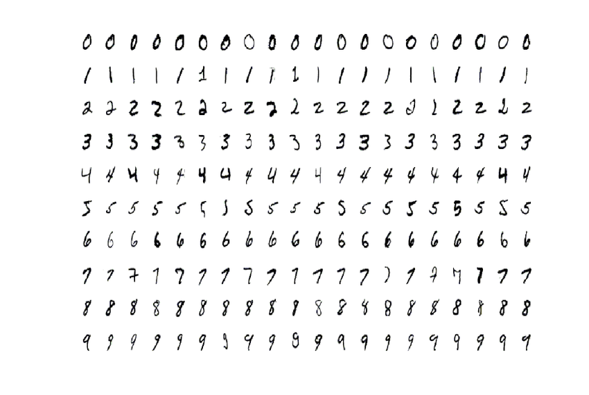

# Classification of Handwritten Digits using Pytorch :smile:

In this article, I will explain how to code a simple neural network in PyTorch to classify hand-written digits. This tutorial expects a basic understanding of Machine Learning and Python. You can run the code as it is using Google Colab.

Let's get started!!

## Imports

```python
import torch
from torch import nn
from torch.utils import data
from torch.utils.data import DataLoader
from torchvision import datasets
from torchvision import transforms
from torchvision.transforms import ToTensor, Normalize, Compose
import matplotlib.pyplot as plt
import tqdm
%matplotlib inline
```
This are some imports that will be required. I will explain the importance of each and every import as we will use them.

## Downloading Data and Preprocessing

For any machine learning project Data is very important. For this project we will need the MNIST dataset which is a database of handwritten digits. This dataset consists of 70,000 images out of which 60,000 are used for training and 10,000 are used for testing.



Fortunately, PyTorch itself provides the data, making our job easy. Therefore, we dont need to download it separately and load it into our project. But there is a catch, the data that we get are images and their labels. We cannot use this data directly in PyTorch as it only works with Tensors. Therefore, we need to convert the image into tensor before going forward to implementing Neural Network.

```
[0.0000, 0.0000, 0.0000, 0.0000, 0.5333, 0.9922, 0.9922, 0.9922,
0.8314, 0.5294, 0.5176, 0.0627, 0.0000, 0.0000, 0.0000, 0.0000,
0.0000, 0.0000, 0.0000, 0.0000, 0.0000, 0.0000, 0.0000, 0.0000,
0.0000, 0.0000, 0.0000, 0.0000],
```

```
[-1.0000, -1.0000, -1.0000, -1.0000,  0.0667,  0.9843,  0.9843,
0.9843,  0.6627,  0.0588,  0.0353, -0.8745, -1.0000, -1.0000,
-1.0000, -1.0000, -1.0000, -1.0000, -1.0000, -1.0000, -1.0000,
-1.0000, -1.0000, -1.0000, -1.0000, -1.0000, -1.0000, -1.0000]
```
